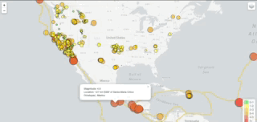

# Visualizing data with Leaflet

The script presented is focused on generating a map that plots two things. The first one is all of the earthquakes from the last 7 days based on their longitude and latitude. And the second, the tectonic plates to illustrate the relationship between these two variables.

The dataset from the tectonic plates can be found in this github [repository](https://github.com/fraxen/tectonicplates) and the data from the earthquakes is at [USGS GeoJSON Feed](http://earthquake.usgs.gov/earthquakes/feed/v1.0/geojson.php) page.

## Features

* Use of Leaflet.js
* Multiple layer map

## Built with 

* Lealfet.js
* HTML
* CSS
* Bootstrap

## Outcomes

Generated Map that has the following characteristics:

* Data markers that reflect the magnitude of the earthquake in their size and color. Earthquakes with higher magnitudes appear larger and darker in color.

* Include popups that provide additional information about the earthquake when a marker is clicked.

* Legend that provide context for the map data.

* The map give you the chance to active or deactivate the earthquakes and tectonic plates layers, as well as changing the view of the entire map.

